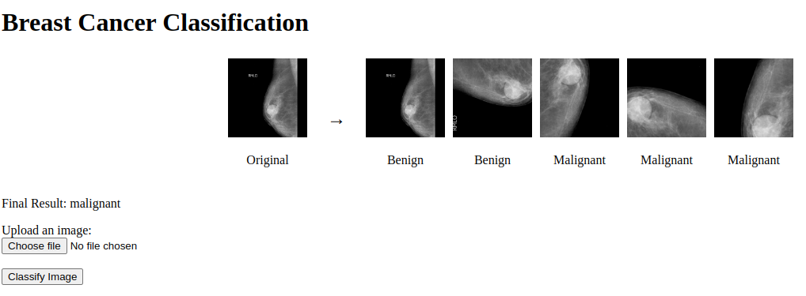
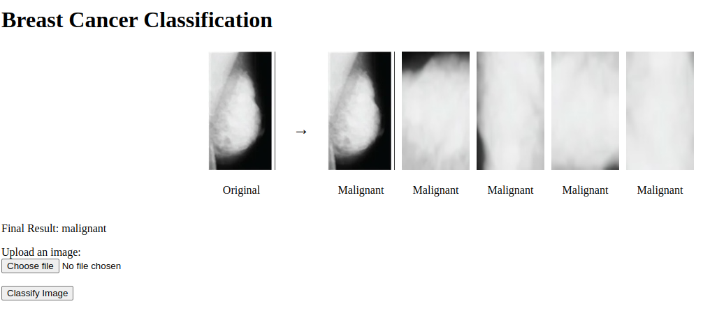

# Task 
- This project simplifies mammogram classification into benign or malignant categories, making it accessible and easy to use, especially for non-technical individuals. The primary goal is to provide a hassle-free solution for users who wish to classify mammogram images without the need to understand or execute complex technical processes.
- A user-friendly backend interface is integrated into the project, enabling users to upload an image with a single click and receive an immediate classification result.
- To further streamline the process, Docker integration is employed, allowing the application to run seamlessly on any system without the need for manual library installations.

### How to run it
- Begin by pulling the Docker image from Docker Hub using the following command: ``docker pull shilpi06/bcancerdet:latest``
- Launch the user interface and upload your mammogram image for classification by executing: ``docker container run shilpi06/bcancerdet:latest``
- After running this command, open your web browser and go to ``http://172.17.0.3:5000`` to access the interface.

### About Dataset: 
- The dataset used for training can be accessed [here](https://www.kaggle.com/datasets/skooch/ddsm-mammography). 
- The dataset contains 55885 images in total which have been further divided for training and testing. 
- One important point to note is that the dataset is highly imbalanced, as out of 55885 images only 7289 (18%) represents malignant case. 
- To deal with this problem, I tried several combinations of class weighting, oversampling, callbacks, modification in the model architecutre and eventually achieved a good tradeoff between precision and recall.
- Initial input images had shape 229x229, but for training the images were reduced to 100x100 shape and to standardize them, they were modified to have 3 channels by replicating the grayscale values. 

### Images of Web Interface: 

  
  

